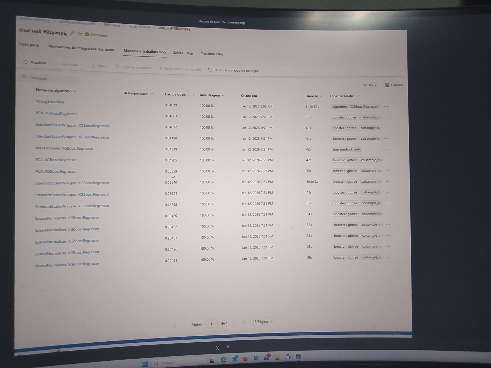

# Introdução
É proposto o seguinte desafio na plataforma DIO:
Imagine que você é proprietário de uma sorveteria chamada Gelato Mágico, localizada em uma cidade litorânea. Você percebe que a quantidade de sorvetes vendidos diariamente tem uma forte correlação com a temperatura ambiente. No entanto, sem um planejamento adequado, você pode acabar produzindo mais sorvetes do que o necessário e ter prejuízos com desperdícios ou, ao contrário, produzir menos e perder vendas.

Para solucionar esse problema, você decide usar Machine Learning para prever quantos sorvetes serão vendidos com base na temperatura. Com esse modelo, será possível antecipar a demanda e planejar a produção de maneira eficiente.

# Implementação

Foram feitas análises de Machine Learning na plataforma Azure. Duas estratégias foram usadas a AutoML que funciona mais como uma "caixa preta", nele são permitidas o uso de diversas estratégias simultâneas como, por exemplo, KNN, árvores de decisão, random forest entre outras. Porém para garantir agilidade do processo foi usado apenas o método XGBoostRegressor.

Na primeira figura temos exemplos gerados por IA contendo temperaturas diversas e dados de vendas de sorvete.

Em primeira análise vamos testar a implementação feita por um pipeline no designer. Ele está descrito na figura abaixo.

Os resultados estão na tabela abaixo, vemos que chegamos a uma arpoximação muito boa da previsão por meio da regressão com os resultados tabelados. As maiores discrepâncias se encontram para os valores muito altos ou muito baixos de temperatura ou venda de sorvetes.

E os valores de erro se encontram represntados abaixo.

Com isso o dono da sorveteria pode nos casos de maior discrepância prever uma maior margem de erro nos extremos dos dados. Podendo nesse caso produzir mais sorvetes que o previsto por precaução ou manter o número atual, analisando se é preferível deixar de vender sorvetes para não haver desperdício ou garantir a venda, havendo o risco de que esses desperdícios ocorram.
Em AutoML foram obtidas também previsões de alta qualidade, inclusive melhores que no designer na técnica que performou melhor, VotingEnsemble, com correlação de spearman de 0,98441 e erro absoluto de média 2,0149. Demais dados estão presentes na figura abaixo.

# Conclusão
Foram testadas duas abordagens, a AutoML que pode ser usada por qualquer um mesmo sem grandes conhecimentos de Machine Learning, pois funciona como uma "caixa preta" e um pipeline descrito no designer que permite maior configuração e controle sobre o que está sendo feito. Com o AutoML foi obtido resultados melhores, o que mostra a robustez e a qualidade dessa solução, porém um melhor design no pipeline pode vir a alterar esse resultado.
